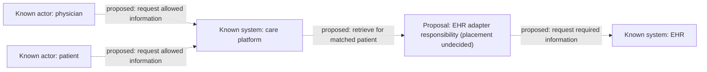

# Worked example: thin integration brief

Source:

> We need to connect our care platform to an EHR so physicians and patients can see relevant patient information.

**Known:** care platform, EHR, physicians, patients, and the requested information-viewing outcome. The brief describes a desired integration, not an implemented flow.

**Inferred:** the outcome requires a way to select the correct patient's information, retrieve it, and control who may view it. The brief does not establish the identity mechanism or access policy.

**Unknown:** vendor/protocol, required data, authoritative identifiers, freshness, write-back scope, consent requirements, and the current platform architecture. For an existing platform, inspect its relevant architecture before recommending implementation components.

This diagram illustrates one **proposal**, conditional on that inspection. Neither a dedicated adapter nor a platform copy of EHR data is established by the brief; a live retrieval approach may meet the outcome.

All relationships shown are proposed. Known actors and systems do not imply known APIs, auth flows, deployed services, or storage.

| Candidate work | Basis and responsibility | Dependencies / unresolved decisions | Observable acceptance evidence |
|---|---|---|---|
| Investigate current integration and EHR capabilities | Unknown: discover existing boundaries and provider contract | Architecture access, provider documentation; owner unknown | Documented supported retrieval and identity behavior, with evidence |
| Correlate patient identities | Inferred: information must belong to the intended patient | Identifier authority; no-match and ambiguous-match policy | Proposed: no-match and multiple-match cases avoid displaying another patient's information |
| Retrieve and display allowed information | Inferred: fulfill viewing outcome | Required dataset, access policy, provider contract; adapter placement is a proposal | Proposed: each intended actor sees the allowed dataset; disallowed access is denied |
| Define freshness and failure behavior | Inferred: dependency failure affects viewing; caching is a design option | Freshness expectations, live retrieval versus stored copy | Proposed: an unavailable provider produces understandable behavior; stale-data treatment remains undecided |

Decide data scope, identity authority, access policy, and freshness before committing to sync infrastructure or storage. These are illustrative concerns and proposed evidence, not agreed clinical requirements or a ready backlog.
